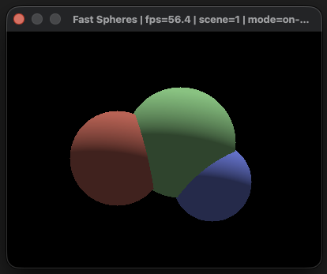
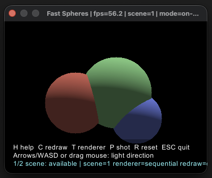
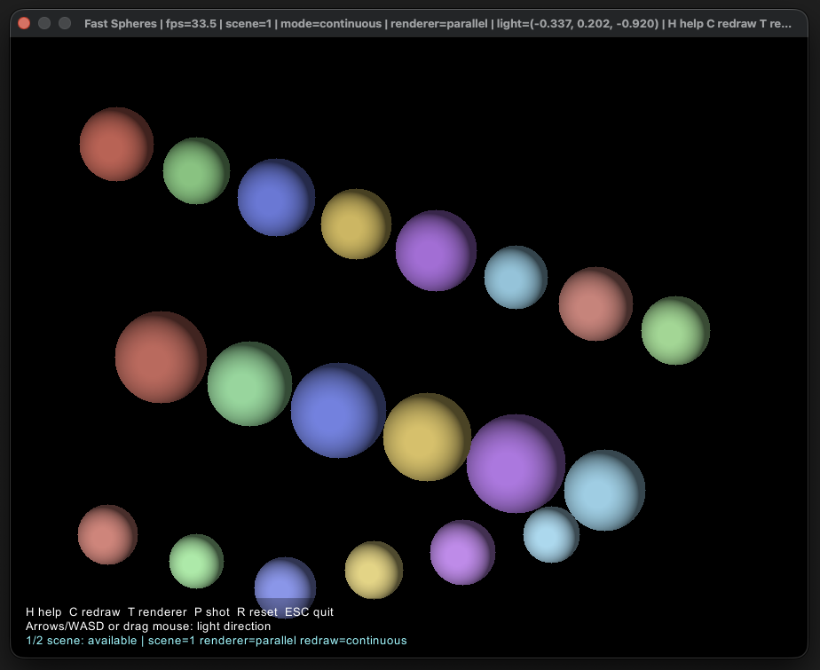
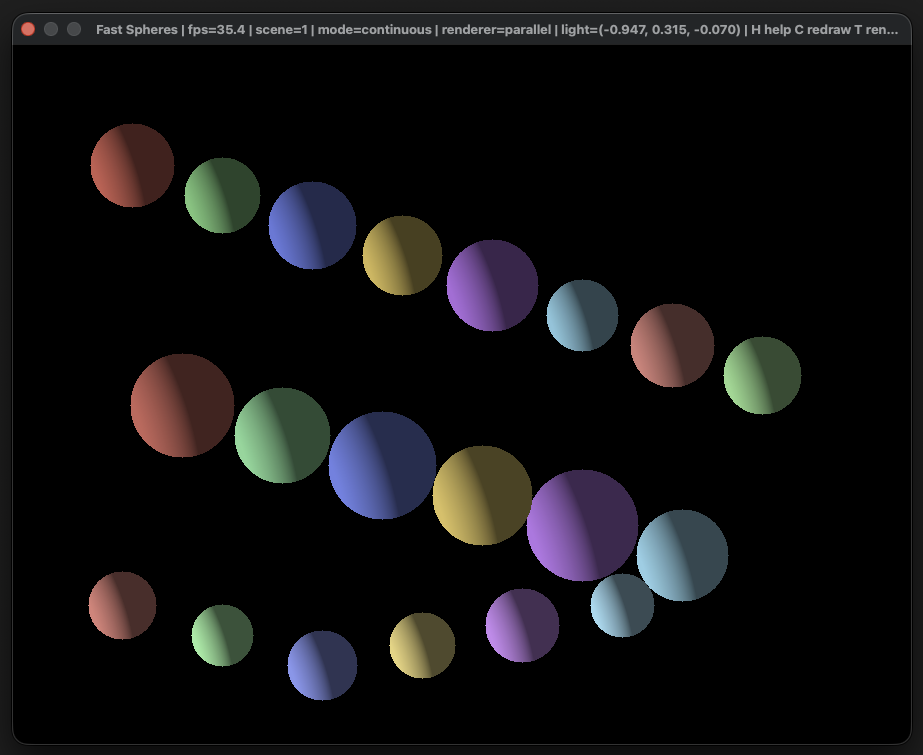

# fast_spheres
[](https://github.com/deefex/fast_spheres/actions/workflows/ci.yml)

A modern recreation of the my Fast Spheres Senior Honours project way back in 19[REDACTED], now centered on a Rust interactive renderer.

## Primary Engine (Rust)

The primary implementation is in `rust/`:

- `rust/fast_spheres_core`: rendering core (Lambert/parabolic fast-sphere variants)
- `rust/fast_spheres_app`: interactive app + file render utility
- `rust/scenes/*.json`: demo scene inputs

## Quick Start (Rust)

```bash
cd /Users/deefex/github/fast_spheres/rust
cargo run -p fast_spheres_app -- scenes/demo_scene.json --interactive --scene2 scenes/demo_scene_alt.json
```

Dense stress scene:

```bash
cd /Users/deefex/github/fast_spheres/rust
cargo run -p fast_spheres_app -- scenes/demo_dense_parallel.json --interactive --continuous --scene2 scenes/demo_dense.json
```

## Controls

- `Arrow keys` / `WASD`: move light direction
- `Left mouse drag`: rotate light direction
- `H`: toggle help overlay
- `C`: toggle redraw mode (`on-change` / `continuous`)
- `T`: toggle renderer (`sequential` / `parallel`)
- `1` / `2`: switch between primary and secondary scenes (`--scene2`)
- `P`: save PNG snapshot to `rust/snapshot_<unix_ts>.png`
- `R`: reset light
- `Esc`: quit

## Screenshots

Demo scene (clean view):



Demo scene (with compact help overlay):



Dense scene (continuous + parallel):



Dense scene (alternate light/view):



## Performance Tracking

Use:

```bash
cd /Users/deefex/github/fast_spheres
make perf-note
```

Then run the interactive scenarios and fill FPS values in `PERF_NOTES.md`.

## Tests

Rust + parity tests:

```bash
cd /Users/deefex/github/fast_spheres
make test
```

## CI and Releases

GitHub Actions workflows:

- `.github/workflows/ci.yml`
  - Rust formatting/check/tests
  - Python↔Rust parity test
- `.github/workflows/release.yml`
  - Runs on tags matching `v*`
  - Builds `fast_spheres_app` on Linux/macOS/Windows
  - Uploads packaged binaries/scenes to the GitHub Release

To cut a release:

```bash
git tag v0.2.0
git push origin v0.2.0
```

## Archived Python Implementation

The original Python recreation is archived under:

- `archive/python/src`
- `archive/python/tests`
- `archive/python/requirements.txt`

Legacy commands:

```bash
cd /Users/deefex/github/fast_spheres
make legacy-test-py
make legacy-bench
make legacy-demo
```

## Common Make Targets

```bash
make demo
make bench
make rust-interactive
make rust-interactive-dense
make rust-interactive-dense-parallel
make parity
make test
make fmt
make fmt-check
```
